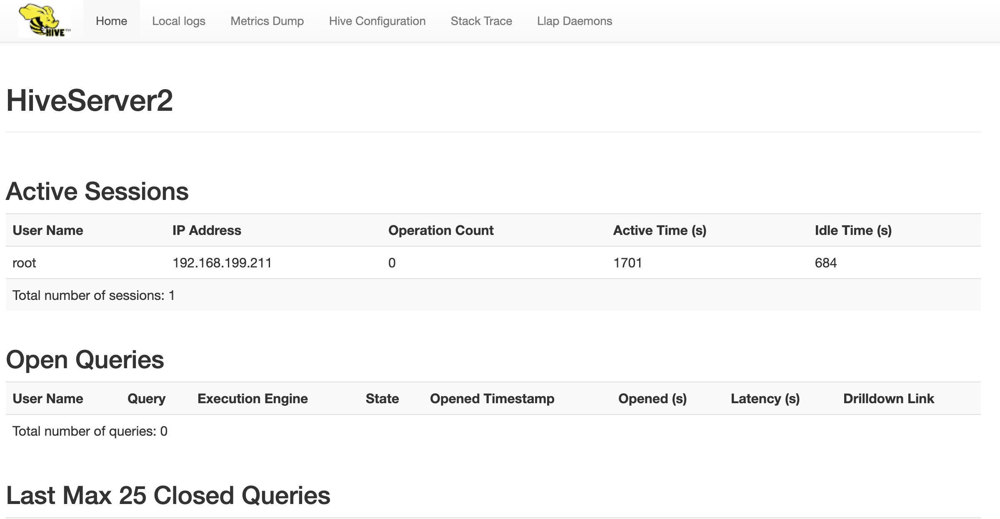

# 安装
vi .bash_profile
```
    export HIVE_HOME=/home/hadoop/app/hive-1.1.0-cdh5.7.0
    export PATH=$HIVE_HOME/bin:$PATH
```

cp hive-env.sh.template hive-env.sh

hive-env.sh 添加HADOOP_HOME
```
  HADOOP_HOME=/home/hadoop/app/hadoop-2.6.0-cdh5.7.0
```

vim conf/hive-site.xml
```aidl
<configuration> 
        <!-- 配置连接串 -->
        <property>
            <name>javax.jdo.option.ConnectionURL</name>
            <!-- createDatabaseIfNotExist=true：当数据库不存在的时候，自动帮你创建 -->
            <value>jdbc:mysql://localhost:3306/rdb_hive?createDatabaseIfNotExist=true</value>
        </property>
        <!-- mysql的driver类 -->
        <property>
            <name>javax.jdo.option.ConnectionDriverName</name>
            <value>com.mysql.cj.jdbc.Driver</value>
        </property>
        <!-- 用户名 -->
        <property>
            <name>javax.jdo.option.ConnectionUserName</name>
            <value>root</value>
        </property>
        <!-- 密码 -->
        <property>
            <name>javax.jdo.option.ConnectionPassword</name>
            <value>123456</value>
        </property>
	
	<property> 
   		 <name>hive.cli.print.current.db</name>
		 <value>true</value>
	</property>
	<property> 
	         <name>hive.cli.print.header</name>
	         <value>true</value>
	</property>
	<!-- 这是hiveserver2 -->
	<property>
       		 <name>hive.server2.thrift.port</name>
     		 <value>10000</value>
	</property>
    	<property>
       		<name>hive.server2.thrift.bind.host</name>
       		<value>192.168.199.211</value>
     	</property>
    </configuration>
```

# 初始化元数据
```
 bin/schematool -dbType mysql -initSchema
```

# 使用shell
```
hive>create table hive_wordcount(context string);
hive> show tables;
hive> show databases;
hive> load data local inpath '/Users/tang/bd/apache-hive-2.3.7-bin/test/test1.txt' into table hive_wordcount;
hive> select * from hive_wordcount;
hive> select word,count(1) from hive_wordcount lateral view explode(split(context,' ')) wc as word group by word;
hive> use databases;
```


# 使用beeline
```
bin/beeline

beeline> !connect jdbc:hive2://192.168.199.211:10000
Connecting to jdbc:hive2://192.168.199.211:10000
Enter username for jdbc:hive2://192.168.199.211:10000: root
Enter password for jdbc:hive2://192.168.199.211:10000: ******
Connected to: Apache Hive (version 2.3.7)
Driver: Hive JDBC (version 2.3.7)
Transaction isolation: TRANSACTION_REPEATABLE_READ
```
或者
```aidl
$HIVE_HOME/bin/beeline -u jdbc:hive2://localhost:10000;auth=hive2;password=hive2
```


# 启动hive 服务
```aidl
 bin/hive --service hiveserver2
```
配置文件hive-site.xml增加
```aidl
	<!-- 这是hiveserver2 -->
	<property>
       		 <name>hive.server2.thrift.port</name>
     		 <value>10000</value>
	</property>
    	<property>
       		<name>hive.server2.thrift.bind.host</name>
       		<value>192.168.199.211</value>
     	</property>
```

# 网页访问
```aidl
http://localhost:10002/
```
